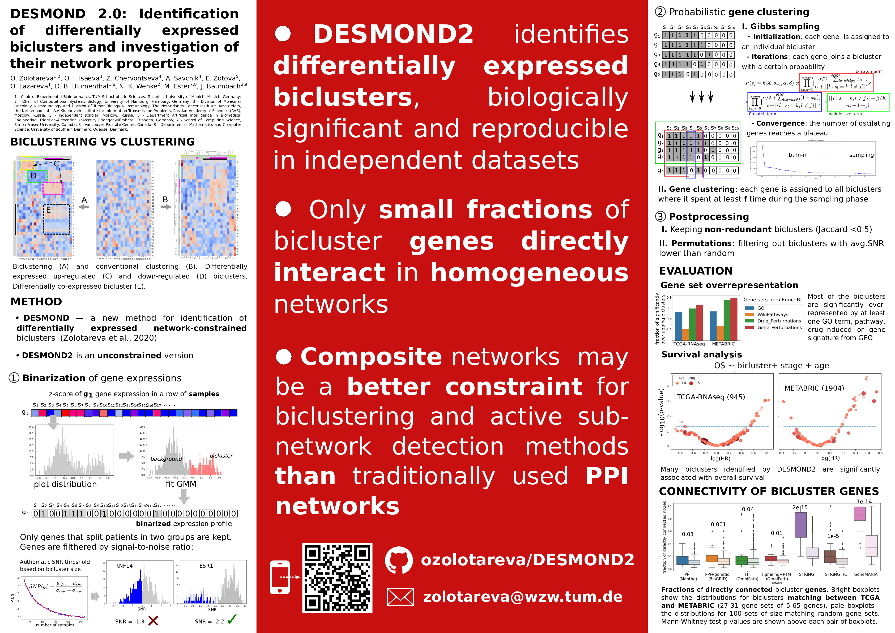

# DESMOND2

DESMOND2 is a novel method for identification of differentially expressed biclusters.
It is an unconstrained version of DESMOND [https://github.com/ozolotareva/DESMOND][repository],  [https://academic.oup.com/bioinformatics/article/37/12/1691/6039116?login=true][publication]

Major modifications:
 * does not require the network 
 * DESMOND2 clusters individual genes instead of gene pairs
 * uses Gaussian mixture models for binarization of gene expressions
 * a gene may be assigned to multiple biclusters where it spent more than f time during the sampling phase
 * SNR threshold is authomatically determined based on bicluster size and user-defined p-value cutoff

## Requirements:
<pre>
Python:
    fisher==0.1.9
    jenkspy==0.2.0
    pandas==1.4.2
    python-louvain==0.15
    matplotlib-venn==0.11.6
    numba==0.51.2
    numpy==1.22.3
    scikit-learn==0.23.1
    scikit-network==0.24.0
    scipy==1.7.1
    statsmodels==0.13.2

R:
    WGCNA==1.70-3
</pre>

## Examples
* DESMOND2 requires a tab-separated file with standardized expressions of genes (or transcripts) in rows, and samples in columns. Gene and sample IDs must be unique. 
* A subset of 200 randomly chosen samples from TCGA-BRCA and DESMOND2 output:
<url>https://drive.google.com/file/d/1GXR_1ErIPtQkEOxE66at0uqQN76qNG7a/view?usp=sharing</url>

<pre>
# running DESMOND2 with default parameters on example data
python run_desmond.py --exprs TCGA_200.exprs_z.tsv --basename TCGA_200_results

# with different binarization and clustering methods
python run_desmond.py --exprs standardized_expressions.tsv --basename results --binarization Jenks --clustering WGCNA

# help
python run_desmond.py -h
</pre>

## Outputs
* <basename>.bin=[GMM|Jenks],clust=[Louvain|WGCNA|DESMOND].biclusters.tsv - a .tsv table with fond biclsuters.
    - avgSNR is average SNR over all genes in the biclusters
    - columns "n_genes" and "n_samples" provide the numbers of genes and samples, respectively 
    - "gene","sample" contain gene and sample ids respectively
    - "gene_i" and  "sample_i" - gene and sample indices in the input matrix,  
* binarized expressions [if clustering is WGCNA,  or  '--save_binary' flag is added]
* modules found by WGCNA [if clustering is WGCNA]

## Poster

